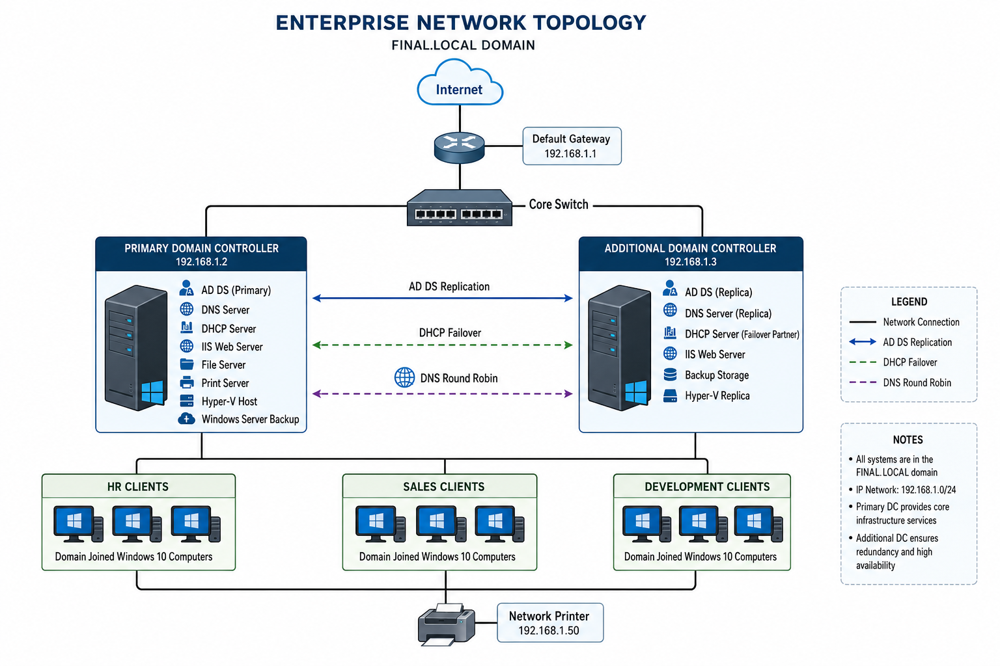
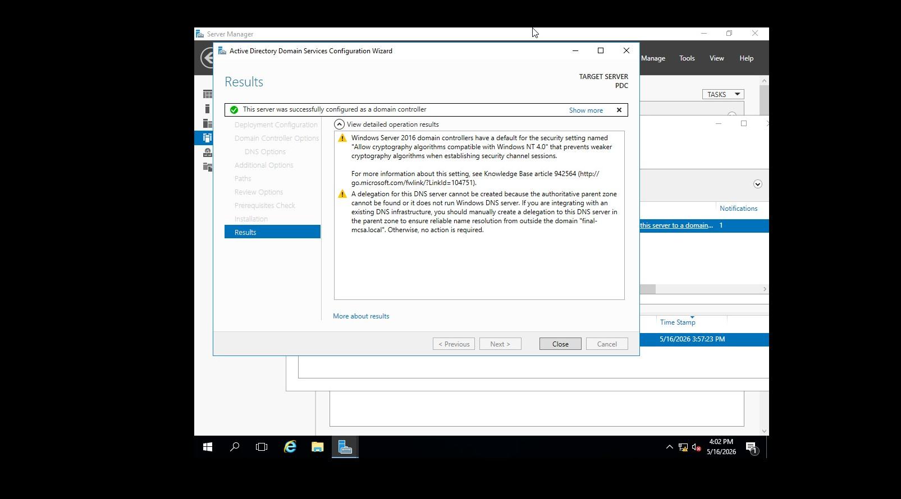
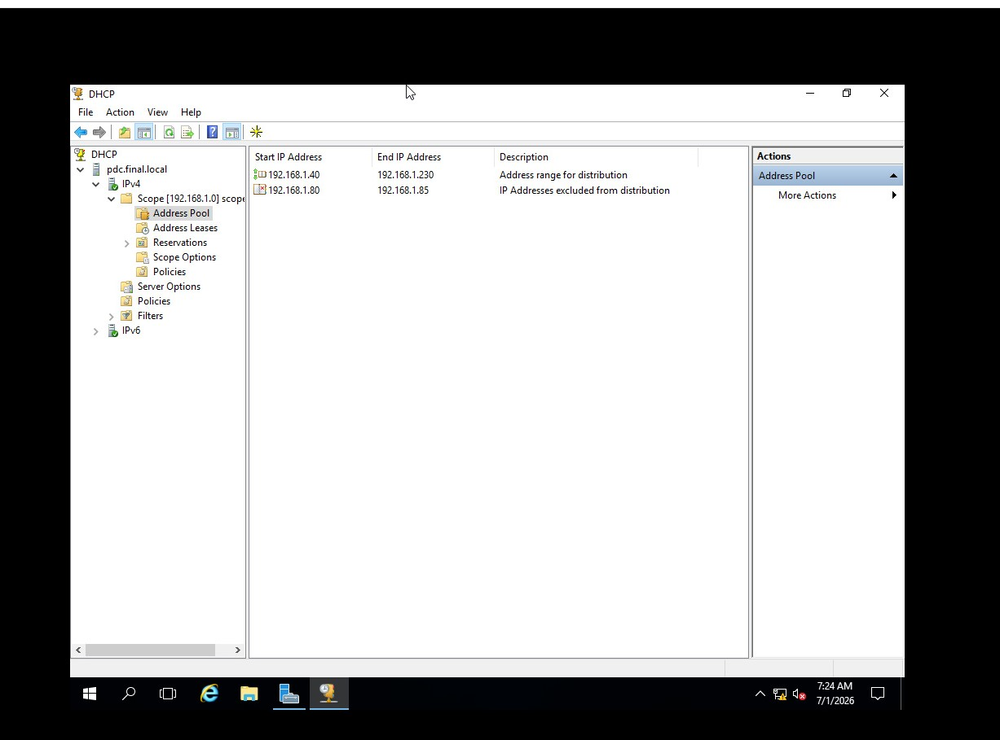
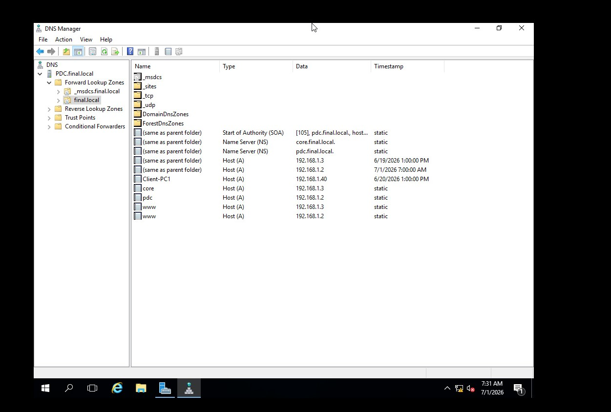
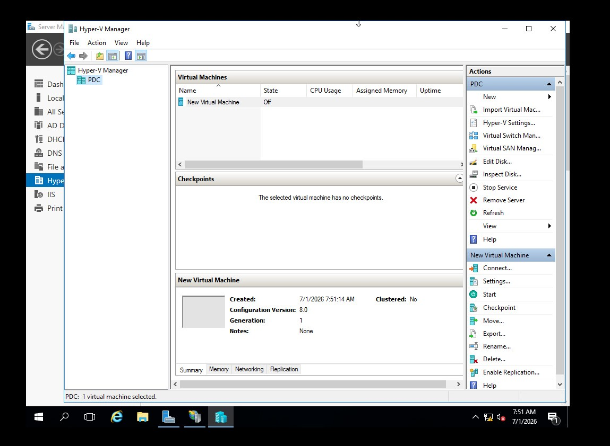
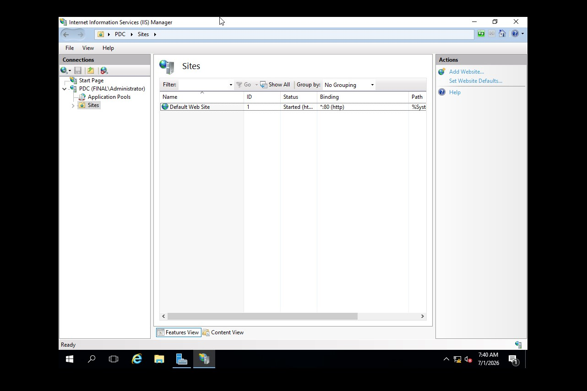

# Enterprise Network Infrastructure using Windows Server 2016
## Overview

This project demonstrates the design and implementation of a complete enterprise network infrastructure using Microsoft Windows Server 2016.

The infrastructure simulates a medium-sized organization and provides centralized authentication, network management, virtualization, backup, and resource sharing.

### Features
- Active Directory Domain Services (AD DS)
- DNS Server
- DHCP Server
- DHCP Failover
- Group Policy
- IIS Web Server
- File Server
- Print Server
- Hyper-V
- Hyper-V Replica
- Windows Server Backup

### Network Topology 

## Technologies
- Windows Server 2016
- Active Directory
- DNS
- DHCP
- IIS
- Hyper-V
- Group Policy
- VMware Workstation

## Screenshots

### Active Directory 

### DHCP

### DNS

### Hyper-V

### IIS 

### Documentation

[Download the Project Report](Windows-Server-Report.pdf)

### skills Demonstrated
- Active Directory Administration
- Windows Server Deployment
- Group Policy Management
- DHCP Configuration
- DNS Configuration
IIS Deployment
Hyper-V Virtualization
Backup and Recovery
Network Security

